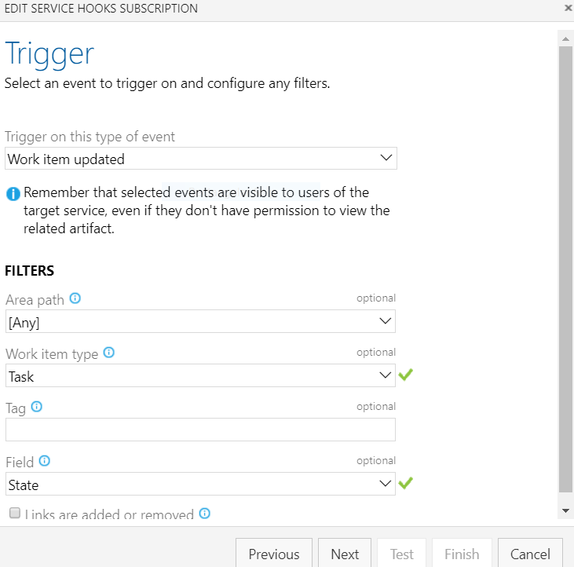
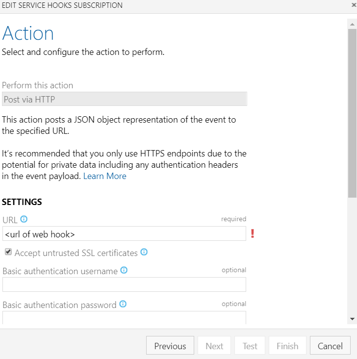

# Azure Boards - Automate State Transitions
This project was created to help automate the updating of parent state transitions depending on the state of the child work items.

This API recieves an Azure Boards work item update web hook event. The API will load the work item, check against a series of rules, and update it's parent work item accordingly. 

For example, if your User Story is New and you create a task and set that task to active, the User Story should automatically be set to Active.

# Setup
1. Create a new Azure DevOps [Personal Access Token](https://docs.microsoft.com/en-us/azure/devops/organizations/accounts/use-personal-access-tokens-to-authenticate)

2. Include the Personal Access Token into the appsettings.json file
   ```
    "AppSettings": {
    "PersonalAccessToken": "<personal access token>",
    "Organization": "",
    "SourceForRules": "https://raw.githubusercontent.com/microsoft/azure-boards-automate-state-transitions/master/src/AutoStateTransitions/Rules/"
    ```  

3. Deploy the project so that it is available from the Azure DevOps instance.

4. Create a new web hook for the child work item types. In this example we are just setting up web hooks for when Task work items are updated. The web hook should send when the state field is changed.

   


   

5. Update the rules in the JSON configuration file for each child work item type. In this example we are going to update the Task (rule.task.json). You will need an entry for each state.

   ```
   {
     "type": "Task",
     "rules": [
        {
          "ifChildState": "Active",
          "notParentStates": [ "Active", "Resolved" ],
          "setParentStateTo": "Active",
          "allChildren": false
         },
         {
          "ifChildState": "New",
          "notParentStates": [ "Active", "Resolved", "New" ],
          "setParentStateTo": "Active",
          "allChildren": false
         },
         {
          "ifChildState": "Closed",
          "notParentStates": [],
          "setParentStateTo": "Closed",
          "allChildren": true
        }
      ]
    }
    ```
    
    **ifChildStates**: If the the work item status is this

    **notParentStates**: If the parent state is not one of these

    **setParentStateTo**: Then set the parent state to this

    **allChildren**: If true, then all child items need to be this state to update the parent

    #### Example 1

    User Story is set to New and it has 4 Tasks that are also new. As soon as a task is set to "Active" then set the User Story to "Active".

    ```
    {
      "ifChildState": "Active",
      "notParentStates": [ "Active", "Resolved" ],
      "setParentStateTo": "Active",
      "allChildren": false
    },
    ````

    #### Example 2

    If User Story is "Active" and all the child Tasks are set to "Closed". Then lets set the User Story to "Closed"

     ```
    {
      "ifChildState": "Closed",
      "notParentStates": [],
      "setParentStateTo": "Closed",
      "allChildren": false
    },
    ````

6. Point to the correct url for your rules files. By default the rules files are [stored in this location](https://raw.githubusercontent.com/microsoft/azure-boards-automate-state-transitions/master/src/AutoStateTransitions/Rules/). You can edit the location in the [appsettings.json](https://github.com/microsoft/azure-boards-automate-state-transitions/blob/master/src/AutoStateTransitions/appsettings.json) file.

    ```
    "AppSettings": {
    "PersonalAccessToken": "<personal access token>",
    "Organization": "",
    "SourceForRules": "https://raw.githubusercontent.com/microsoft/azure-boards-automate-state-transitions/master/src/AutoStateTransitions/Rules/"
    ```  

   ***Note: Rule files have only been setup for User Story and Task.***  

# Contributing

This project welcomes contributions and suggestions.  Most contributions require you to agree to a
Contributor License Agreement (CLA) declaring that you have the right to, and actually do, grant us
the rights to use your contribution. For details, visit https://cla.opensource.microsoft.com.

When you submit a pull request, a CLA bot will automatically determine whether you need to provide
a CLA and decorate the PR appropriately (e.g., status check, comment). Simply follow the instructions
provided by the bot. You will only need to do this once across all repos using our CLA.

This project has adopted the [Microsoft Open Source Code of Conduct](https://opensource.microsoft.com/codeofconduct/).
For more information see the [Code of Conduct FAQ](https://opensource.microsoft.com/codeofconduct/faq/) or
contact [opencode@microsoft.com](mailto:opencode@microsoft.com) with any additional questions or comments.
